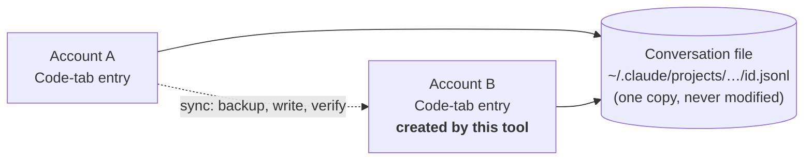

# Claude Session Sync

**Hit your usage limit on one Claude account? Keep going on another, in the same Claude Code session.**

Claude Session Sync is a small Windows tool for people who use **more than one Claude account** with the **Claude Desktop app (Code tab)** on the same PC. It makes a session started under account A show up in account B's Code tab, pointing at the *same* conversation, so you can pick up exactly where you stopped.

- No copying of conversations. No editing of history. Nothing deleted.
- Works automatically in the background, or by hand from a GUI or command line.
- Every change is backed up first, verified afterwards, and can be undone with one command.
- Python standard library only. Nothing to install.

---

## The problem

Claude Desktop keeps each account's Code-tab sessions separate. Sign in with a second account and your session list is empty, even though the conversation is still on your disk.

## How this tool solves it

A Code session is really two things:

| Part | Where it lives | Shared between accounts? |
|---|---|---|
| **The conversation** (every message, tool call, result) | `~/.claude/projects/<project>/<id>.jsonl` | **Yes**: one file, on your disk |
| **The Code-tab entry** (title, folder, model, settings) | `claude-code-sessions/<account>/<org>/local_<id>.json` | **No**: one per account |

So the tool never touches the conversation. It only creates (and later updates) the small Code-tab entry for the other account, pointing at the same conversation file.



The entry is **not** a raw file copy. Fields that belong to the source account (its connector list, its "you've hit your limit" error, remote-control links) are left out; Claude Desktop regenerates them for the new account.

---

## Quick start

**Requirements:** Windows and Python 3.9+ (or a prebuilt `.exe`, see [Building](#building)).

### Option 1: Automatic (recommended)

1. **Quit Claude Desktop completely** (tray icon, then Quit).
2. Double-click **`claude-session-sync-gui.cmd`**.
3. Open the **Auto-sync** tab, click **Turn on**, and confirm.

From then on a hidden watcher starts with Windows:

| What happens | What the tool does |
|---|---|
| Claude Desktop is **open** | Nothing. Desktop rewrites its own files while running, so they must not be touched. |
| You **quit** Claude Desktop | About 8 seconds later it mirrors your sessions between your accounts. |
| Desktop reopens within those 8 seconds | The sync is cancelled. |

**Daily routine**

1. Work in Claude Desktop under account A.
2. Account A hits its limit: **quit Desktop** and wait about 10 seconds.
3. Open Desktop, sign in as account B, open the Code tab. Your session is there. Carry on.
4. Later, do the same in reverse.

> **Quitting Desktop is the trigger.** Switching accounts without quitting syncs nothing.

### Option 2: By hand

```bat
claude-session-sync.cmd sessions                                        :: list sessions and their health
claude-session-sync.cmd preview -S <from> -T <to> -s "session title"    :: dry run, writes nothing
claude-session-sync.cmd sync    -S <from> -T <to> -s "session title" --close-desktop --restart-desktop
claude-session-sync.cmd rollback                                        :: undo the last sync
```

Accounts can be given as a full id, a unique id prefix, an e-mail, or a label set with `label <account> <name>`.

> **Run from a normal terminal or Explorer, not from a Code-tab session inside Claude Desktop.**
> Closing Desktop from a process Desktop owns would kill the tool mid-write, so the tool refuses.

---

## What it syncs

| Synced | Not synced |
|---|---|
| Claude Desktop **Code-tab** sessions that run locally | Sessions started only in the `claude` **terminal** |
| Title, project folder, model, permission mode, turn counters, session lineage | **Cowork** |
| | **Cloud** sessions (they live on Anthropic's servers) |
| | Remote-Control, worktree, SSH/WSL, scheduled-task and imported sessions |
| | Sessions you **deleted** in the target account (never brought back unless you ask) |

### What to expect after switching accounts

- **Background tasks and monitors don't carry over.** They are live processes of the old session. The conversation and what they reported are kept; start them again if you still need them.
- **A notice about "thinking from another organization".** Claude's earlier reasoning is signed to the account that produced it. It stays on disk but isn't reused; Claude re-reads the visible conversation instead. Harmless, but the first reply may be a little slower.
- **The first message re-reads the whole history** at full cost, because nothing is cached under the new account yet. Long sessions use noticeably more of the new account's allowance once.

---

## Safety

| Guarantee | How |
|---|---|
| **Preview first** | `preview`, `scan`, `sessions`, `verify` and `report` never write anything. |
| **Conversations are never modified** | Transcripts are only read; a test checks they are byte-identical before and after. |
| **Backup before every change** | Full copy of the session store, hashed and verified, in `%USERPROFILE%\.claude-session-sync\backups\`. |
| **Atomic writes** | Temp file, then rename. A crash can't leave a half-written record. |
| **Verified afterwards** | Only the planned files changed, each matches its intended SHA-256, the transcript is intact, the new entry is healthy. |
| **Automatic rollback** | Any failure or failed check restores the previous state by itself. |
| **Undo any time** | `rollback` restores the exact earlier files and refuses to overwrite anything you changed since. |
| **Desktop guard** | Won't write while Desktop runs, or if started from inside it. |
| **App-update guard** | If a Claude update changes the storage format, the tool stops instead of guessing. |
| **Nothing silently overwritten** | Conflicts, deleted sessions and "target is ahead" are reported per session. |

**Two rules for you**

1. Don't use the *same* session in two accounts at the same time; both would write to one conversation file.
2. **Archive** a synced session instead of deleting it. Deleting in one account can let Claude clean up the shared conversation file the other account still uses. The Auto-sync tab warns about sessions in this state.

---

## Auto-sync settings

In the GUI (**Auto-sync** tab) or on the command line:

```bat
claude-session-sync.cmd auto status                          :: running? last run? what's waiting?
claude-session-sync.cmd auto run --dry-run                   :: show what a sync would do now
claude-session-sync.cmd auto run                             :: sync now (Desktop must be closed)
claude-session-sync.cmd auto config --max-age-days 2         :: only sessions active in the last N days (default 7, 0 = all)
claude-session-sync.cmd auto config --one-way <from> <to>    :: A to B only
claude-session-sync.cmd auto config --accounts <A> <B>       :: only these accounts, both ways
claude-session-sync.cmd auto config --keep-backups 20        :: automatic backups to keep (default 40)
claude-session-sync.cmd auto disable                         :: turn it off
claude-session-sync.cmd launch                               :: sync, then open Claude Desktop
```

Only *automatic* backups are ever pruned; manual ones are kept.
What the hidden watcher did: `%USERPROFILE%\.claude-session-sync\watch.log`.
If you move the tool's folder, run `auto enable` again.

---

## Troubleshooting

| Symptom | Likely cause and fix |
|---|---|
| Session didn't appear in the other account | Desktop is still running (check the tray). Quit it, wait 15 s, then run `auto status`. |
| `Skipped: Claude Desktop is running` | Expected. Quit Desktop; the watcher or `auto run` then proceeds. |
| A session shows *Needs review: running right now* | It's still open. Stop it, then sync. |
| Something looks wrong | `claude-session-sync.cmd rollback` |
| Want to see what changed | `claude-session-sync.cmd history` and `verify --deep` |
| Tool stopped after a Claude update | The storage format may have changed. Run `scan`; it reports what is missing. See [docs/RESEARCH.md](docs/RESEARCH.md). |

Diagnostic report (no conversation content, no credentials): `claude-session-sync.cmd report --redact`

---

## Commands

```
scan | accounts | sessions | preview | sync | verify | backup | rollback | restore | history | report | label | desktop | gui
auto status | config | run | enable | disable | start | stop      watch [--quiet]      launch
global options: --data-root DIR   --claude-home DIR   --state-dir DIR   --json
```

Run any command with `-h` for its options. Exit codes: `0` ok, `1` failed or aborted, `2` blocked or usage error.

---

## Building

```bat
python build_pyz.py                                  :: dist\claude-session-sync.pyz (single file)
python -m venv build\venv
build\venv\Scripts\pip install pyinstaller
build\venv\Scripts\python build_exe.py               :: dist\claude-session-sync.exe + claude-session-sync-gui.exe
```

Tests (49, on synthetic data folders; your real store is never touched):

```bat
python tests/test_sync.py
python tests/test_auto.py
```

## Project layout

```
claude_session_sync/
  store.py, analysis.py     find accounts, sessions and transcripts; judge their health
  planner.py                decide exactly what to write (pure, writes nothing)
  executor.py               backup, atomic write, verify, rollback
  autosync.py               automatic mode: one pass, background watcher, start with Windows
  desktop.py, winproc.py    detect, close and restart Claude Desktop
  schema.py                 which record fields are copied, dropped or blocking
  ui_server.py, ui/         the GUI (local, token-protected, shown in an Edge/Chrome app window)
docs/RESEARCH.md            how Claude stores sessions: evidence and findings
tests/                      unit and end-to-end tests
```

## Limits

- Built against Claude Desktop **2.7032.0** on Windows 11 (MSIX install). On start the tool checks that the installed app still uses the storage names it relies on, and refuses to write if not.
- Windows only, and Claude Desktop only: it does not touch the Claude Code terminal's own login.
- Not affiliated with or endorsed by Anthropic. It reads and writes Claude Desktop's local files, an undocumented and changeable format. The tool makes backups; use it at your own risk.
